# Agent IAM


Agent IAM is a policy engine and authorization boundary designed to safely govern AI agent tool executions. It provides declarative policies, human-in-the-loop approvals, audit sinks, and checkpointing for safe, concurrent, and auditable tool use.

## Zero-Config Quickstart

Guard a tool call in 10 lines of code, completely in-memory:

```javascript
import { definePolicy, createAgentIAM } from "@agentiam/core";

// 1. Initialize IAM with a policy
const iam = createAgentIAM({
  policy: definePolicy({ rules: [{ id: "safe", when: { action: "read_logs" }, decision: "allow" }] })
});

// 2. Guard your tool execution
const request = { actor: { type: "agent", id: "bot" }, action: { name: "read_logs" } };
const result = await iam.guard(request, async () => {
  return "Tool actually executed!";
});

console.log(result.executed); // true
```

## Ecosystem

The Agent IAM project consists of seven interoperable packages built around a central core:

| Package | Type | Description |
|---|---|---|
| `@agentiam/core` | **Core** | The central policy engine and execution guard. |
| `@agentiam/langgraph` | **Framework Adapter** | A seamless `Command`-driven `Node` adapter for LangGraph. |
| `@agentiam/openai` | **Framework Adapter** | Guards raw tool calls generated by the OpenAI SDK. |
| `@agentiam/vercel-ai` | **Framework Adapter** | Guards tools provided to the Vercel AI SDK `generateText` and `streamText`. |
| `@agentiam/anthropic` | **Framework Adapter** | Guards raw `tool_use` blocks generated by the Anthropic SDK. |
| `@agentiam/pg` | **Persistence Adapter**| Production-ready Postgres adapters for storing checkpoints and audit logs. |
| `@agentiam/sqlite` | **Persistence Adapter**| Lightweight local SQLite persistence for checkpoints and audit logs. |

```bash
# Install core
npm install @agentiam/core

# Install integrations
npm install @agentiam/langgraph @agentiam/openai @agentiam/vercel-ai @agentiam/anthropic @langchain/core @langchain/langgraph openai ai @anthropic-ai/sdk

# Install Postgres or SQLite persistence
npm install @agentiam/pg pg
npm install @agentiam/sqlite better-sqlite3
```

## How It Works

Agent IAM intercepts calls from your agent and evaluates them against a centralized policy before the tool actually executes. If a tool execution requires human approval or clarification, Agent IAM skips execution and emits a `Checkpoint`. This checkpoint can later be resumed safely once approval is granted.



### 1. Define Policies

Policies declare the boundary. You specify matchers (`when`), security decisions (`allow`, `deny`, `approval_required`, `clarification_required`), and required evidence.

```javascript
import { definePolicy } from "@agentiam/core";

const policy = definePolicy({
  id: "finance-policy",
  rules: [
    {
      id: "delete-prod-db",
      when: { action: "delete_database", context: { env: "prod" } },
      decision: "deny"
    },
    {
      id: "transfer-funds",
      when: { action: "transfer_money" },
      decision: "approval_required",
      requirements: ["manager_approval"]
    }
  ]
});
```

### 2. Guard Tool Executions (Core)

Use `createAgentIAM` to protect your execution boundary.

```javascript
import { createAgentIAM } from "@agentiam/core";

const iam = createAgentIAM({ policy });

const request = {
  actor: { type: "agent", id: "bot1" },
  action: { name: "transfer_money", input: { amount: 5000 } }
};

const result = await iam.guard(request, async () => {
  return await myBankAPI.transfer(5000);
});

console.log(result.executed); // false
console.log(result.checkpoint.id); // "chk_123..."
```

### 3. LangGraph Integration

If you use LangGraph, replace your `ToolNode` with Agent IAM's `createGuardedToolNode`. It automatically converts IAM checkpoints into LangGraph `interrupt()` commands!

```javascript
import { createGuardedToolNode } from "@agentiam/langgraph";

const guardedTools = createGuardedToolNode({
  tools: myTools,
  iam,
  mapToolCall: (toolCall, state) => ({
    actor: { type: "agent", id: state.agentId },
    action: { name: toolCall.name, input: toolCall.args }
  })
});

// Use `guardedTools` in your graph builder...
```

### 4. Postgres Persistence

For production environments, memory storage isn't enough. Configure Agent IAM to persist checkpoints and emit auditable logs directly to Postgres.

```javascript
import { Pool } from "pg";
import { PostgresCheckpointStore, createPostgresAuditSink } from "@agentiam/pg";

const pool = new Pool({ connectionString: process.env.DATABASE_URL });

const iam = createAgentIAM({
  policy,
  checkpointStore: new PostgresCheckpointStore(pool),
  auditSink: createPostgresAuditSink(pool)
});
```

## Security & Concurrency Guarantees

- **Pre-Execution Claims**: Checkpoint resumption locks atomic execution in Postgres *before* the tool logic fires. If two instances of a worker attempt to resume the exact same approved checkpoint at the same time, one succeeds and the other explicitly rejects, eliminating double-execution race conditions.
- **Fail-Closed Playback**: Once a checkpoint is consumed or expired, any future attempt to replay its ID results in an immediate denial. Checkpoint IDs act as single-use, safely-expiring authorization tokens.
- **Strict Auditing**: Every transition (evaluation, approval, execution) emits structured updates to the audit sink.

## Project Status

v0.1.2 — Active development. Core, LangGraph adapter, OpenAI adapter, Vercel AI adapter, and 
Postgres persistence are available. We're looking for early 
adopters and contributors. Open an issue or start a discussion!

## License
MIT
